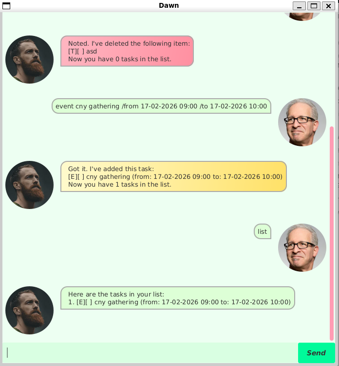

# Dawn User Guide

Dawn is a *task-focused* chatbot that helps you track to-dos, deadlines and events in a fast, command-driven workflow. 



# Quick Start

1. Install Java `17` or later.
2. Download `dawn.jar` from [here](https://github.com/darkrelicz/ip/releases/tag/A-BetterGui)
3. In the same folder, run `java -jar dawn.jar`.
4. Enter commands in the input box and press Send. 

# Command Format notes
* Commands are case-insensitive (e.g. `LiSt` works the same as `list`).
* Indexes are 1-based, meaning to say they start from index 1 onwards.
* Date/time input uses the format `dd-MM-yyyy HH:mm`.

# Features
## Add a to-do task: `todo`

Adds a task with no date and time. 

Format: `todo DESCRIPTION`

Example: `todo read book`

## Add a deadlline task: `deadline`

Adds a task that specifies the due date

Format: `deadline DESCRIPTION /by dd-MM-yyyy HH:mm`

Example: `deadline buy groceries /by 10-10-2026 17:00`

## Add an event: `event`

Adds a task that spans a time range

Format: `event DESCRIPTION /from dd-MM-yyyy HH:mm /to dd-MM-yyyy HH:mm`

Example: `event cny celebrations /from 17-02-2026 00:00 /to 19-02-2026 23:59`

## List tasks: `list`

Shows all tasks, regardless of completion status

Format: `list`

## Mark tasks as done: `mark`

Mark a task as completed.

Format: `mark TASK_INDEX`

Example: `mark 1`

# Mark tasks as not done: `unmark`

Mark a task as not completed.

Format: `unmark TASK_INDEX`

Example: `unmark 1`

## Delete tasks: `delete`

Delete a task.

Format: `delete TASK_INDEX`

Example: `delete 1`

## Find task by keyword: `find`

Find tasks whose descriptions contain the keyword (case-insensitive). 

Optionally, find tasks whose task type matches the given task type.

Format: `find [/type TASK_TYPE] KEYWORD`, where those enclosed in square brackets `[]` are optional input

Examples:
```
find report
find /type event
find /type deadline report
```

## Exit the app: `bye`, `exit`

Closes Dawn chatbot.

Format: `bye`, `exit`

# Data Storage

Tasks are saved automatically to `/data/data.csv` after each command that modifies your data. 

# Command Summary

| Action | Format, Examples |
| ------ | ---------------- |
| Create a to-do task | `todo DESCRIPTION` e.g. `todo read book` |
| Create a deadline task | `deadline DESCRIPTION /by dd-MM-yyyy HH:mm` e.g. `deadline buy groceries /by 10-10-2026 17:00` |
| Create an event task | `event DESCRIPTION /from dd-MM-yyyy HH:mm /to dd-MM-yyyy HH:mm` e.g.`event cny celebrations /from 17-02-2026 00:00 /to 19-02-2026 23:59` |
| List all tasks | `list` |
| Mark a task as completed | `mark TASK_INDEX` e.g. `mark 1` |
| Mark a task as not completed | `unmark TASK_INDEX` e.g. `unmark 1` |
| Delete a task | `delete TASK_INDEX` e.g. `delete 1` |
| Find a task with matching keyword or task type | `find [/type TASK_TYPE] KEYWORD` e.g. `find report`, `find /type event`, `find /type deadline report` |
| Exit the app | `exit`, `bye` |